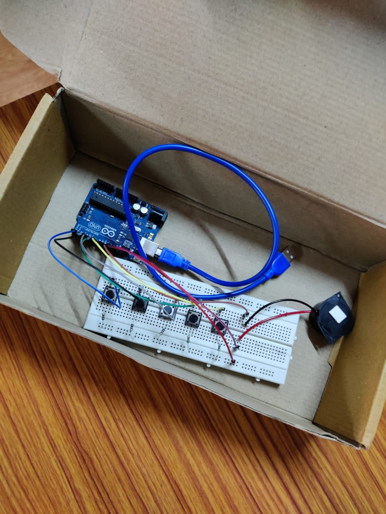
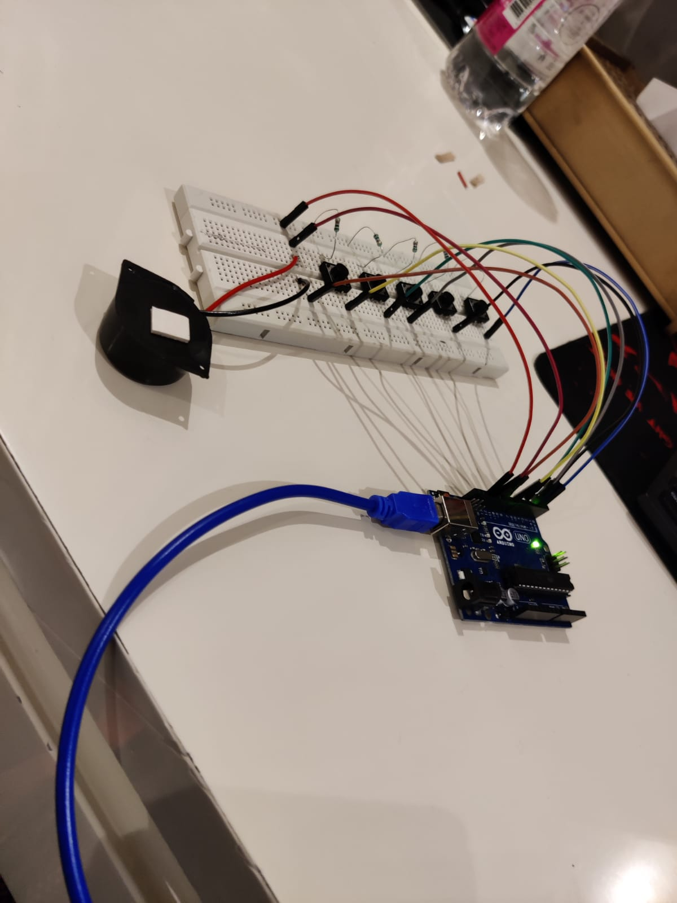

# Arduino Piano Player 🎹🔊

This project demonstrates an Arduino-based piano that plays musical tones using push buttons and a piezo buzzer. Each button corresponds to a musical note (C, D, E, F, G, A). It's a fun DIY embedded system with sound!

---

## 📘 Abstract

The Arduino Piano Player allows users to press push-buttons and generate musical notes using a buzzer. It demonstrates how input pins, tone generation, and loop logic work in microcontrollers.

---

## 🧰 Components Used

- Arduino Uno
- Piezo Buzzer
- Push Buttons (6x)
- Jumper Wires
- Breadboard

---

## 🧪 Procedure (Summarized)

1. Connect push buttons to pins 2–7.
2. Connect piezo buzzer to pin 8.
3. Upload the code using Arduino IDE.
4. Press buttons to play different tones.

---

## 🔣 Arduino Code

```cpp
int buzzer = 8;
int buttonPins[] = {2, 3, 4, 5, 6, 7};
int tones[] = {262, 294, 330, 349, 392, 440}; // Notes: C D E F G A

void setup() {
  for (int i = 0; i < 6; i++) {
    pinMode(buttonPins[i], INPUT);
  }
  pinMode(buzzer, OUTPUT);
}

void loop() {
  for (int i = 0; i < 6; i++) {
    if (digitalRead(buttonPins[i]) == HIGH) {
      tone(buzzer, tones[i]);
      delay(300);
      noTone(buzzer);
    }
  }
}

```

## 🖼️ Project Setup Images
- 🎛️ Piano Wiring

<br>

-🧪 Button Testing


<br>

## 🎥 Demo Video

📥 [Click here to watch/download demo_showcase.mp4](Video/demo_showcase.mp4)

---

## 📄 Project Files

- 📄 [Project_Report.pdf](Report/Project_Report.pdf)
- 🎞️ [Piano_Presentation.pptx](Presentation/Piano_Presentation.pptx)
- 💻 [piano_code.txt](Code/piano_code.txt)


## 👨‍🎓 Author
Yatin Vadehra
B.Tech Electronics and Communication Engineering
<br>
The NorthCap University (2021–2025)
